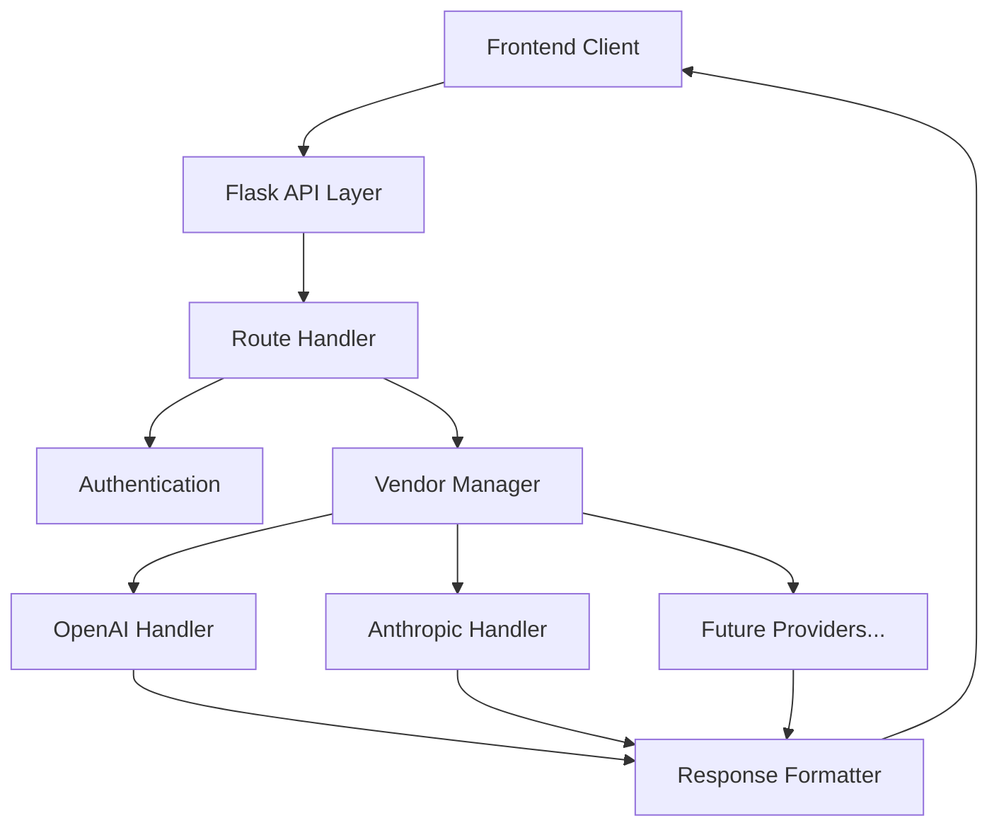

# System Patterns

## Architecture Overview

## Core Components

1. **API Layer** (`app/api.py`)

   - RESTful endpoints
   - Request validation
   - Error handling
   - Response formatting

2. **Configuration** (`app/config.py`)

   - Environment-based settings
   - API keys management
   - Feature flags
   - System defaults

3. **Data Models** (`app/model.py`)

   - Database schema
   - Model relationships
   - Data validation
   - Query interfaces

4. **Utilities** (`app/utils.py`)
   - Helper functions
   - Common operations
   - Shared functionality

## Design Patterns

1. **Factory Pattern**

   - Used for vendor-specific handler creation
   - Enables easy addition of new providers
   - Maintains consistent interface

2. **Strategy Pattern**

   - Different strategies for different AI providers
   - Swappable implementation details
   - Common interface contract

3. **Adapter Pattern**

   - Normalizes different vendor APIs
   - Standardizes response formats
   - Handles provider-specific quirks

4. **Repository Pattern**
   - Database abstraction
   - Clean data access
   - Separation of concerns

## Technical Decisions

1. **Flask Framework**

   - Lightweight and flexible
   - Easy to extend
   - Good community support
   - Simple routing system

2. **SQLAlchemy ORM**

   - Robust database operations
   - Migration support
   - Model relationships
   - Query optimization

3. **RESTful Architecture**

   - Standard HTTP methods
   - Clear endpoint structure
   - Stateless operations
   - Resource-based URLs

4. **Migration System**
   - Version controlled schema
   - Safe database updates
   - Rollback capability
   - Change tracking

## Security Patterns

1. **Authentication**

   - API key validation
   - User authentication
   - Role-based access

2. **Data Protection**

   - Environment variables for secrets
   - Secure configuration
   - Safe error handling

3. **Request Validation**
   - Input sanitization
   - Schema validation
   - Rate limiting
   - Request size limits
